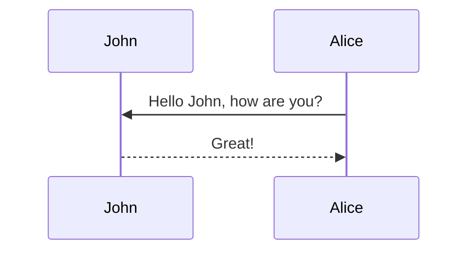

This theme supports generating various diagrams from a text description using [mermaid](https://mermaid-js.github.io/mermaid/){:target="\_blank"}. Previously, this was done using the [jekyll-diagrams](https://github.com/zhustec/jekyll-diagrams){:target="\_blank"} plugin. For more information on this matter, see the [related issue](https://github.com/alshedivat/al-folio/issues/1609#issuecomment-1656995674).

To enable mermaid, you have to put the following in this post frontmatter:

```yml
mermaid:
  enabled: true
  zoomable: true
```

To disable the zooming feature, set `mermaid: zoomable` to `false`.

## Mermaid

The diagram below was generated by the following code:

````markdown

````


redirect のやりかた

---
layout: post
title: a post with redirect
date: 2022-02-01 17:39:00
description: you can also redirect to assets like pdf
redirect: /assets/pdf/example_pdf.pdf
---

Redirecting to another page.

table を使いたい時
pretty_table: true

多分 dataset の中身とかを使う時に便利
## More Complex Example

By using [Bootstrap Table](https://bootstrap-table.com/) it is possible to create pretty complex tables, with pagination, search, and more. For example, the following HTML code will display a table, loaded from a JSON file, with pagination, search, checkboxes, and header/content alignment. For more information, check the [documentation](https://examples.bootstrap-table.com/index.html).



```html
<table
  data-click-to-select="true"
  data-height="460"
  data-pagination="true"
  data-search="true"
  data-toggle="table"
  data-url="{{ '/assets/json/table_data.json' | relative_url }}"
>
  <thead>
    <tr>
      <th data-checkbox="true"></th>
      <th data-field="id" data-halign="left" data-align="center" data-sortable="true">ID</th>
      <th data-field="name" data-halign="center" data-align="right" data-sortable="true">Item Name</th>
      <th data-field="price" data-halign="right" data-align="left" data-sortable="true">Item Price</th>
    </tr>
  </thead>
</table>
```



<table
  data-click-to-select="true"
  data-height="460"
  data-pagination="true"
  data-search="true"
  data-toggle="table"
  data-url="{{ '/assets/json/table_data.json' | relative_url }}">
  <thead>
    <tr>
      <th data-checkbox="true"></th>
      <th data-field="id" data-halign="left" data-align="center" data-sortable="true">ID</th>
      <th data-field="name" data-halign="center" data-align="right" data-sortable="true">Item Name</th>
      <th data-field="price" data-halign="right" data-align="left" data-sortable="true">Item Price</th>
    </tr>
  </thead>
</table>

jupyter notebook
{::nomarkdown}






<p>Sorry, the notebook you are looking for does not exist.</p>

{:/nomarkdown}


custom のメッセージ、 warning とか
---
layout: post
title: a post with custom blockquotes
date: 2023-05-12 15:53:00-0400
description: an example of a blog post with custom blockquotes
tags: formatting blockquotes
categories: sample-posts
giscus_comments: true
related_posts: true
---

This post shows how to add custom styles for blockquotes. Based on [jekyll-gitbook](https://github.com/sighingnow/jekyll-gitbook) implementation.

We decided to support the same custom blockquotes as in [jekyll-gitbook](https://sighingnow.github.io/jekyll-gitbook/jekyll/2022-06-30-tips_warnings_dangers.html), which are also found in a lot of other sites' styles. The styles definitions can be found on the [\_sass/\_typograms.scss](https://github.com/alshedivat/al-folio/blob/main/_sass/_typograms.scss) file, more specifically:

```scss
/* Tips, warnings, and dangers */
.post .post-content blockquote {
  &.block-tip {
    border-color: var(--global-tip-block);
    background-color: var(--global-tip-block-bg);

    p {
      color: var(--global-tip-block-text);
    }

    h1,
    h2,
    h3,
    h4,
    h5,
    h6 {
      color: var(--global-tip-block-title);
    }
  }

  &.block-warning {
    border-color: var(--global-warning-block);
    background-color: var(--global-warning-block-bg);

    p {
      color: var(--global-warning-block-text);
    }

    h1,
    h2,
    h3,
    h4,
    h5,
    h6 {
      color: var(--global-warning-block-title);
    }
  }

  &.block-danger {
    border-color: var(--global-danger-block);
    background-color: var(--global-danger-block-bg);

    p {
      color: var(--global-danger-block-text);
    }

    h1,
    h2,
    h3,
    h4,
    h5,
    h6 {
      color: var(--global-danger-block-title);
    }
  }
}
```

A regular blockquote can be used as following:

```markdown
> This is a regular blockquote
> and it can be used as usual
```

> This is a regular blockquote
> and it can be used as usual

These custom styles can be used by adding the specific class to the blockquote, as follows:

<!-- prettier-ignore-start -->

```markdown
> ##### TIP
>
> A tip can be used when you want to give advice
> related to a certain content.
{: .block-tip }
```

> ##### TIP
>
> A tip can be used when you want to give advice
> related to a certain content.
{: .block-tip }

```markdown
> ##### WARNING
>
> This is a warning, and thus should
> be used when you want to warn the user
{: .block-warning }
```

> ##### WARNING
>
> This is a warning, and thus should
> be used when you want to warn the user
{: .block-warning }

```markdown
> ##### DANGER
>
> This is a danger zone, and thus should
> be used carefully
{: .block-danger }
```

> ##### DANGER
>
> This is a danger zone, and thus should
> be used carefully
{: .block-danger }

<!-- prettier-ignore-end -->

VIDEO
<div class="row mt-3">
    <div class="col-sm mt-3 mt-md-0">
        
    </div>
    <div class="col-sm mt-3 mt-md-0">
        
    </div>
</div>
<div class="caption">
    A simple, elegant caption looks good between video rows, after each row, or doesn't have to be there at all.
</div>

It does also support embedding videos from different sources. Here are some examples:

<div class="row mt-3">
    <div class="col-sm mt-3 mt-md-0">
        
    </div>
    <div class="col-sm mt-3 mt-md-0">
        
    </div>
</div>

related を表示させたい (自動) -> 普通に設定パートで related : True にする

つけたほうがいい
```yml
toc:
  sidebar: left
```

chart は e-charts や chart.js で作れる

複数の選択肢の tab を作る
tabs: true
---

This is how a post with [tabs](https://github.com/Ovski4/jekyll-tabs) looks like. Note that the tabs could be used for different purposes, not only for code.

## First tabs

To add tabs, use the following syntax:



```liquid




Content 1





Content 2




```



With this you can generate visualizations like:





```php
var_dump('hello');
```





```javascript
console.log("hello");
```





```javascript
pputs 'hello'
```





## Another example





```yaml
hello:
  - "whatsup"
  - "hi"
```





```json
{
  "hello": ["whatsup", "hi"]
}
```





## Tabs for something else





Regular text





> A quote





Hipster list

- brunch
- fixie
- raybans
- messenger bag





グラフプロット
chart:
  plotly: true
---

This is an example post with some [plotly](https://plotly.com/javascript/) code.

````markdown
```plotly
{
  "data": [
    {
      "x": [1, 2, 3, 4],
      "y": [10, 15, 13, 17],
      "type": "scatter"
    },
    {
      "x": [1, 2, 3, 4],
      "y": [16, 5, 11, 9],
      "type": "scatter"
    }
  ]
}
```
````

Which generates:

```plotly
{
  "data": [
    {
      "x": [1, 2, 3, 4],
      "y": [10, 15, 13, 17],
      "type": "scatter"
    },
    {
      "x": [1, 2, 3, 4],
      "y": [16, 5, 11, 9],
      "type": "scatter"
    }
  ]
}
```

Also another example chart.

````markdown
```plotly
{
  "data": [
    {
      "x": [1, 2, 3, 4],
      "y": [10, 15, 13, 17],
      "mode": "markers"
    },
    {
      "x": [2, 3, 4, 5],
      "y": [16, 5, 11, 9],
      "mode": "lines"
    },
    {
      "x": [1, 2, 3, 4],
      "y": [12, 9, 15, 12],
      "mode": "lines+markers"
    }
  ],
  "layout": {
    "title": {
      "text": "Line and Scatter Plot"
    }
  }
}
```
````

This is how it looks like:

```plotly
{
  "data": [
    {
      "x": [1, 2, 3, 4],
      "y": [10, 15, 13, 17],
      "mode": "markers"
    },
    {
      "x": [2, 3, 4, 5],
      "y": [16, 5, 11, 9],
      "mode": "lines"
    },
    {
      "x": [1, 2, 3, 4],
      "y": [12, 9, 15, 12],
      "mode": "lines+markers"
    }
  ],
  "layout": {
    "title": {
      "text": "Line and Scatter Plot"
    }
  }
}
```
